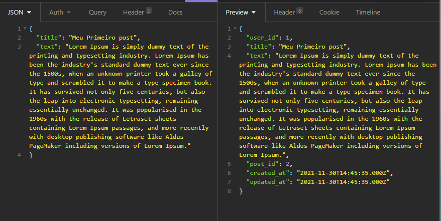

# Praticando conceitos do Node

## Iniciando um projeto node

- Criar o arquivo README na pasta do projeto
- Iniciar o git com o comando `` git init ``
- Iniciar o projeto com o comando `` npm init ``
- criar o arquivo .gitignore na raiz do projeto
- instalar os pacotes iniciais express, dotenv, etc...
- instalar o typescript, ts-node-dev, types, como depedencias de desenvolvimento
- iniciar o typescript com o comando `` npx tsc --init ``
- configurar os scripts no package.json

ex:

``` scripts
 "scripts": {
    "test": "echo \"Error: no test specified\" && exit 1",
    "dev": "ts-node-dev --transpile-only --ignore-watch node_modules ./src/index.ts",
    "build": "tsc",
    "start": "node build/index.js",
    "typeorm": "node --require ts-node/register ./node_modules/typeorm/cli.js"
  }
```

- configurar as variáveis de ambiente no arquivo .env
- adicionar o que deve ser ignorado no .gitignore como o .env e a pasta node_modules por exemplo.

***neste momento já é interessante fazer o nosso primeiro commit***

- adicione os arquivos com o comando `` git add . ``
- faça o commit com `` git commit -m "first commit" ``

## Testes

### Instalando e configurando o jest

- Instale os pacotes ``npm install jest ts-jest @types/jest -D``
- use o comando ``npx ts-jest config:init``
  será criado o arquivo jest.config.js

```jest.config
/** @type {import('ts-jest/dist/types').InitialOptionsTsJest} */
module.exports = {
  preset: 'ts-jest',
  testEnvironment: 'node',
  detectOpenHandles: true
};
```

- Agora vamos ao package.json e configurar o script test
  `` "test": "set NODE_ENV=test& jest --runInBand" ``

Agora já podemos rodar nossos testes com o comando `` npm run test ``

## Iniciando o app

- Crie a pasta src
- Dentro da pasta src vamos criar o arquivo app.ts
  
```App

    import express from 'express'

    const app = express()

    export { app }

```

- Também dentro da pasta src crie o arquivo index.ts
  
```Index
  import 'dotenv/config';
  import { app } from "./app";

  app.listen(process.env.PORT || 3000, () => {
    console.log(`Server is running in ${process.env.BASE_URL}:${process.env.PORT}`)
  })
```

***obs: lembre-se de configurar a porta e a url base nas variáveis de ambiente***

Vamos ver se tudo está funcionando?

``npm run dev``

## Conectando a um Banco de Dados

Usaremos o MYSQL e o typeOrm

- Instale os pacotes ``npm i mysql typeorm reflect-metadata``
- Dentro da pasta src crie uma pasta chamada database
- Dentro da pasta database crie um arquivo index.ts

  ```connection
  import { createConnection } from "typeorm";

  createConnection()
  ```

- No .env adicione as seguinte variáveis de ambiente

```variáveis
TYPEORM_CONNECTION = mysql
TYPEORM_HOST = localhost
TYPEORM_USERNAME = your username
TYPEORM_PASSWORD = your pass
TYPEORM_DATABASE = your database name
TYPEORM_PORT = 3306
TYPEORM_SYNCHRONIZE = false
TYPEORM_LOGGING = false
TYPEORM_ENTITIES = ./src/models/**.ts
TYPEORM_ENTITIES_DIR = ./src/models
TYPEORM_MIGRATIONS = ./src/database/migrations/**.ts
TYPEORM_MIGRATIONS_DIR = ./src/database/migrations
```

- no index da pasta src importe o reflect-metadata e o database

```index
import 'dotenv/config';
import 'reflect-metadata';
import './database';

import { app } from "./app";

app.listen(process.env.PORT || 3000, () => {
    console.log(`Server is running in ${process.env.BASE_URL}:${process.env.PORT}`)
});
```

- Pronto, agora ja temos tudo configurado e já podemos nos conectar com o banco de dados

### criando uma migration

Com o banco de dados já criado e vázio dê o seguinte comando para criar uma migration para uma tabela de usuários por exemplo

``npx typeorm migration:create -n create_users``

Note que dentro da pasta database será criada a pasta migrations e dentro desta a nossa migration

#### Trabalhando com migrations

O nosso arquivo criado vem pré configurado no seguinte formato

```migration
import {MigrationInterface, QueryRunner} from "typeorm";

export class createUsers1638226054013 implements MigrationInterface {

    public async up(queryRunner: QueryRunner): Promise<void> {
    }

    public async down(queryRunner: QueryRunner): Promise<void> {
    }

}
```

Abaixo um exemplo de uma migration de criação de uma tabela de usuários

```users
import {MigrationInterface, QueryRunner, Table} from "typeorm";

export class createUsers1638226054013 implements MigrationInterface {

    public async up(queryRunner: QueryRunner): Promise<void> {
        await queryRunner.createTable(
            new Table({
                name:"users",
                columns:[
                    {
                        name:"id",
                        type:"int",
                        isPrimary:true,
                        isGenerated:true,
                        generationStrategy:"increment"
                    },
                    {
                        name:"name",
                        type:"varchar(50)",
                    },
                    {
                        name:"lastname",
                        type:"varchar(50)",
                    },
                    {
                        name:"email",
                        type:"varchar(150)",
                        isUnique:true
                    },
                    {
                        name:"password",
                        type:"varchar(200)",
                    }
                ]
            })
        )
    }

    public async down(queryRunner: QueryRunner): Promise<void> {
        await queryRunner.dropTable("users")
    }
}
```

Agora é só rodar o comando ``npm run typeorm migration:run`` e nossa tabela de usuários será criada no banco de dados.

## Models/Entities

Agora vamos aprender a configurar nossos models ou entities

- Na pasta src crie a pasta models ou entities
- Dentro da pasta models crie um arquivo User.ts, ou seja nosso modelo de usuário

````User
import { Column, Entity, PrimaryGeneratedColumn } from "typeorm";

@Entity('users')
export class User {
    @PrimaryGeneratedColumn("increment")
    id:number;

    @Column()
    name:string;

    @Column()
    lastname:string;

    @Column({ unique:true })
    email:string;

    @Column({select:false})
    password:string;
}
````

pronto já temos nosso model configurado.

## Repositórios

- Dentro da pasta src crie uma pasta chamada repositories
- Na pasta repositories crie o arquivo UsersRepository.ts

````Repository
import { EntityRepository, Repository } from "typeorm";
import { User } from "../../models/User";

@EntityRepository(User)
export class UsersRepository extends Repository<User>{}
````

## Relações

Para exemplificar como trabalhar com relações no typeorm vamos criar uma nova tabela, posts por exemplo.

- criando a migration
``npx typeorm migration:create -n create_posts``

- configurando a migration

````posts
import {MigrationInterface, QueryRunner, Table} from "typeorm";

export class createPosts1638229610178 implements MigrationInterface {

    public async up(queryRunner: QueryRunner): Promise<void> {
        await queryRunner.createTable(
            new Table({
                name: "posts",
                columns: [
                    {
                        name:"post_id",
                        type:"int",
                        isPrimary:true,
                        isGenerated:true,
                        generationStrategy:"increment"
                    },
                    {
                        name:"user_id",
                        type:"int"
                    },
                    {
                        name:"title",
                        type:"varchar"
                    },
                    {
                        name:"text",
                        type:"text"
                    },
                    {
                        name:"created_at",
                        type:"timestamp",
                        default:"now()"
                    },
                    {
                        name:"updated_at",
                        type:"timestamp",
                        default:"now()"
                    }
                ],
                foreignKeys: [
                   {
                    name:"FKUserPosts",
                    columnNames:["user_id"],
                    referencedColumnNames:["id"],
                    referencedTableName:"users",
                    onDelete:"CASCADE",
                    onUpdate:"CASCADE"
                   }
                ]
            })
        )
    }

    public async down(queryRunner: QueryRunner): Promise<void> {
        await queryRunner.dropTable("posts")
    }

}
````

- Rode o comando `` npm run typeorm migration:run ``

se tudo ocorreu bem a tabela posts foi criada no banco de dados

- crie o model Post

````post
import { Column, CreateDateColumn, Entity, PrimaryGeneratedColumn } from "typeorm";

@Entity('posts')
export class Post {
    @PrimaryGeneratedColumn("increment")
    id:number;

    @Column()
    title:string;

    @Column()
    text:string;

    @CreateDateColumn({ default:Date.now() })
    created_at:Date;

    @CreateDateColumn({ default:Date.now() })
    updated_at:Date;

    @Column()
    user_id:number;
}
````

- crie o repositório

````postsrepository
import { EntityRepository, Repository } from "typeorm";
import { Post } from "../models/Post";

@EntityRepository(Post)
export class PostsRepository extends Repository<Post>{}
````

Bom, agora vamos supor que o usuário pode ter vários posts, mas cada post pertence apenas a um usuário.

- no model Post adicione

````manyToOne
 @ManyToOne(() => User, user => user.posts)
user: User;
````

````Post
import { Column, CreateDateColumn, Entity, ManyToOne, PrimaryGeneratedColumn } from "typeorm";
import { User } from "./User";

@Entity('posts')
export class Post {
    @PrimaryGeneratedColumn("increment")
    id:number;

    @Column()
    title:string;

    @Column()
    text:string;

    @CreateDateColumn({ default:Date.now() })
    created_at:Date;

    @CreateDateColumn({ default:Date.now() })
    updated_at:Date;

    @Column()
    user_id:number;

    @ManyToOne(() => User, user => user.posts)
    user:User;
}
````

- no model User adicione

````òneTomany
@OneToMany(() => Post, posts => posts.user)
posts: Post[];
````

````User
import { Column, Entity, OneToMany, PrimaryGeneratedColumn } from "typeorm";
import { Post } from "./Post";

@Entity('users')
export class User {
    @PrimaryGeneratedColumn("increment")
    id:number;

    @Column()
    name:string;

    @Column()
    lastname:string;

    @Column({ unique:true })
    email:string;

    @Column({select:false})
    password:string;

    @OneToMany(() => Post, posts => posts.user)
    posts: Post[];
}
````

Caso a relação seja de um pra um:

- no model Post não seria necessário alterações
- no model User teriamos:

````User
@OneToOne(() => Post)
@JoinColumn()
post: Post;
````

E se fosse uma relação de muitos para muitos?

- No model Post não teriamos alterações
- No User ficaria:

````User
@ManyToMany(() => Post)
@JoinTable()
posts: Post[];
````

Com isso já temos uma pequena noção de como trabalhar com relaçoes usando o typeorm.

## Tipagem

Para dar continuidade é preciso criar nosso primeiro usuário, mas antes vamos criar nossos types do user e do post.

- Dentro da pasta src crie uma pasta chamada types
- Na pasta types crie o arquivo UserTypes.ts

````userTypes
export type UserTypes = {
    name:string;
    lastname:string;
    email:string;
    password:string;
}
````

e o arquivo PostTypes.ts

````postTypes
export type PostTypes = {
    title:string;
    text:string;
    created_at:string;
    updated_at:string;
    user_id:number;
}
````

## Services

- Na pasta src crie a pasta services
- Crie o arquivo UserServices.ts

````user
import { getCustomRepository, Repository } from "typeorm";
import { User } from "../models/User";
import { UsersRepository } from "../repositories/UsersRepository";

export class UserServices {
    private usersRepository: Repository<User>;

    constructor() {
        this.usersRepository = getCustomRepository(UsersRepository);
    }
}
````

- No arquivo UserServices vamos criar o serviço de criação de um usuário

````userService
import { getCustomRepository, Repository } from "typeorm";
import { User } from "../models/User";
import { UsersRepository } from "../repositories/UsersRepository";
import { UserTypes } from "../types/UserTypes";

export class UserServices {
    private usersRepository: Repository<User>;

    constructor() {
        this.usersRepository = getCustomRepository(UsersRepository);
    }
    
    async setUser(data:UserTypes) {
        try {
            const user = this.usersRepository.create({
                name: data.name,
                lastname: data.lastname,
                email: data.email,
                password: data.password
            })

            await this.usersRepository.save(user);

            return user;
            
        } catch (error) {
            return error
        }
    }
}
````

## Controllers

- Na pasta src crie a pasta controllers
- Dentro de controllers crie o arquivo UserController

### Bcrypt

- Agora vamos a função de criar o usuário, mas antes vamos instalar o Bcrypt ``npm i bcrypt`` e sua tipagem ``npm i @types/bcrypt -D``.Bcrypt é um método de criptografia do tipo hash para senhas.
- Agora sim, tudo pronto para criarmos nossa função

````createUser
import { Request, Response } from "express";
import { UserServices } from "../services/UserServices";
import bcrypt from 'bcrypt'

export class UserController {
    async create(request:Request, response:Response) {
        const userService = new UserServices();

        const { name, lastname, email, password } = request.body;

        try {
            const hash = await bcrypt.hash(password.toString(), 10);

            const data = {
                name,
                lastname,
                email,
                password: hash
            }

            const user = await userService.setUser(data);

            return response.status(201).json(user)
        } catch (error) {
            return response.status(400).json(error)
        }
    }
}
````

Quase tudo pronto

## Rotas

Precisamos criar nossas rotas

- na pasta src crie a pasta routes
- crie um index.ts na pasta routes

````routes
import { Router } from "express";

const router = Router()

export { router }
````

- import o router no app.ts

````app
import express from 'express'
import { router } from './routes'

const app = express()

app.use(router)

export { app }
````

- Ainda no app.ts importe e use o json e o urlencoded do express, e, também, instale e use o pacote cors ``npm i cors`` ``npm i @types/cors -D``
  
````app
import express, { json, urlencoded } from 'express'
import cors from 'cors'
import { router } from './routes'

const app = express()
app.use(cors())
app.use(json())
app.use(urlencoded({ extended:true }))

app.use(router)

export { app }
````

- No arquivo de rotas vamos criar nossa rota para criação de um usuário

````route
import { Router } from "express";
import { UserController } from "../controllers/UserController";

const userController = new UserController();

const router = Router()

router.post('/user', userController.create)

export { router }
````

Agora é só testar usando o Insomnia, Postman, Rest test test, entre outros meios de testar sua api.


Já podemos criar nosso primeiro post, mas antes disso é interessante criar um processo de autenticação e autorização em nosso projeto.

Primeiramente vamos criar um simples sistema de login usando a senha e o email do usuário.

## Autenticação

- Vamos usar o jsonwebtoken em nosso projeto ``npm i jsonwebtoken`` ``npm i @types/jsonwebtoken -D``
- Na pasta services crie o arquivo AuthService.ts
- No .env crie uma variável SECRET com uma senha secreta definida por você
- crie a função de login no AuthService

````login
import { getCustomRepository, Repository } from "typeorm";
import { User } from "../models/User";
import { UsersRepository } from "../repositories/UsersRepository";
import bcrypt from 'bcrypt'
import jwt from 'jsonwebtoken'

export class AuthService {
    private usersRepository: Repository<User>;

    constructor() {
        this.usersRepository = getCustomRepository(UsersRepository);
    }

    async login(email: string, password: string) {
        try {
            const user = await this.usersRepository.findOne({ email }, {
                select:["id", "email", "password"]
            });

            if(!user) {
                return {error: 'User does not exists!'};
            }

            if(!await bcrypt.compare(password, user.password)) {
                return {error: 'Invalid password!'};
            }

            const token = jwt.sign({ id:user.id }, process.env.SECRET, {
                expiresIn:86400
            });

            return {id:user.id, token};
        } catch (error) {
            return error;
        }
    }
}
````

- Na pasta controllers vamos criar nosso AuthController com nossa função de login

````login
import { Request, Response } from "express";
import { AuthService } from "../services/AuthService";

export class AuthController {
    async login(request:Request, response:Response) {
        const auth = new AuthService();

        const { email, password } = request.body;

        try {
            const loggedUser = await auth.login(email, password.toString());

            return response.status(200).json(loggedUser);
        } catch (error) {
            return response.status(400).json(error);
        }
    }
}
````

- Em nosso arquivo de rotas vamos criar a rota de login

````routes
import { Router } from "express";
import { AuthController } from "../controllers/AuthController";
import { UserController } from "../controllers/UserController";

const userController = new UserController();
const authController = new AuthController();

const router = Router()

//Autenticação
router.post('/login', authController.login)


router.post('/user', userController.create)

export { router }
````

- Teste pra ver se ocorreu tudo bem


Agora que temos nosso usuário autenticado e um token vamos criar um método de autorização, pois apenas um usuário autorizado poderá criar posts em nosso sistema.

## Autorização

- De início crie dentro de src uma pasta chamada middlewares
- Dentro de middlewares crie um arquivo chamado Authorize.ts

````authorize
import { NextFunction, Request, Response } from "express";
import jwt from 'jsonwebtoken';

export class Authorize {
    async authorized(request:Request, response:Response, next:NextFunction) {
        try {
            if(!request.headers.authorization) {
                response.json({ notallowed:true })
                return;
            }
    
            let token = '';
    
            if(request.headers.authorization) {
                token = request.headers.authorization;
            }
            if(token == '') {
                response.json({ notallowed:true })
                return;
            }
    
            jwt.verify(token, process.env.SECRET, (err, decoded) => {
                if(err) return response.status(401).json({error: 'Token invalid'})
            });
    
            next();
        } catch (error) {
            return response.json({error})
        }
    }
}
````

Vamos criar nosso post agora

- Na pasta services crie o PostServices.ts

````posts
import { getCustomRepository, Repository } from "typeorm";
import { Post } from "../models/Post";
import { PostsRepository } from "../repositories/PostsRepository";

export class PostServices {
    private postsRepository: Repository<Post>;

    constructor() {
        this.postsRepository = getCustomRepository(PostsRepository)
    }
}
````

- a função de criação do post

````post
async setPost(user_id:number, title:string, text:string) {
    try {
        const post = this.postsRepository.create({
            title,
            text,
            user_id
        })

        await this.postsRepository.save(post)

        return post;
        
    } catch (error) {
        return error
    }
}
````

- Na pasta controllers crie o PostController.ts e dentro dele a função de criação de posts

````posts
import { Request, Response } from "express";
import jwt from 'jsonwebtoken'
import { PostServices } from "../services/PostServices";

export class PostController {
    async create(request:Request, response:Response) {
        const postServices = new PostServices();

        const { title, text } = request.body;

        const token = request.headers.authorization;

        try {
            const loggedUser = jwt.decode(token);

            const post = await postServices.setPost(loggedUser['id'], title, text)

            return response.status(201).json(post)
        } catch (error) {
            return response.status(400).json(error)
        }
    }
}
````

- crie a rota de criação de posts, repare que agora é usado o middleware de authorização nesta rota.

````routes
import { Router } from "express";
import { AuthController } from "../controllers/AuthController";
import { PostController } from "../controllers/PostController";
import { UserController } from "../controllers/UserController";
import { Authorize } from "../middlewares/Authorize";

const userController = new UserController();
const authController = new AuthController();
const authorization = new Authorize();
const postController = new PostController();

const router = Router()

//Autenticação
router.post('/login', authController.login)

//users
router.post('/user', userController.create)

//posts
router.post('/post', authorization.authorized, postController.create)

export { router }
````

Testando

- No Insomnia, adicione o token gerado ao fazer login na aba Header, sem ele não será possível criar o post.



